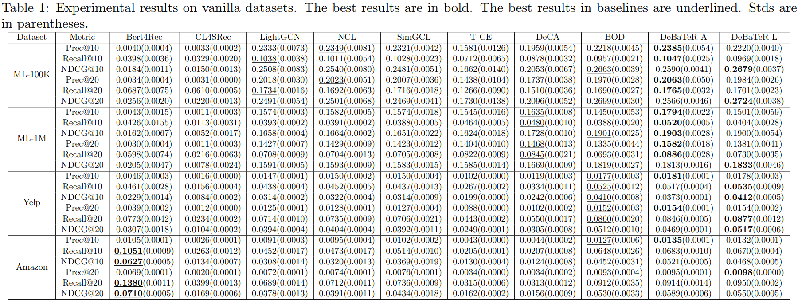
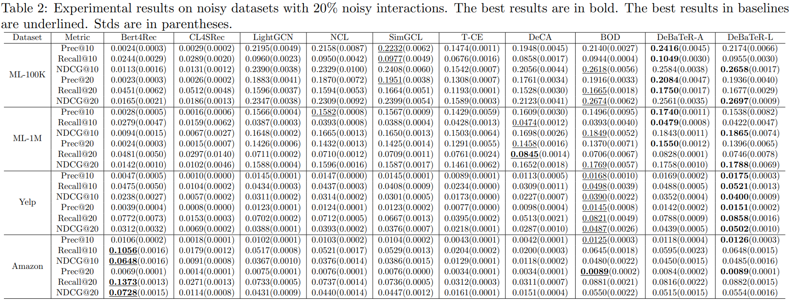
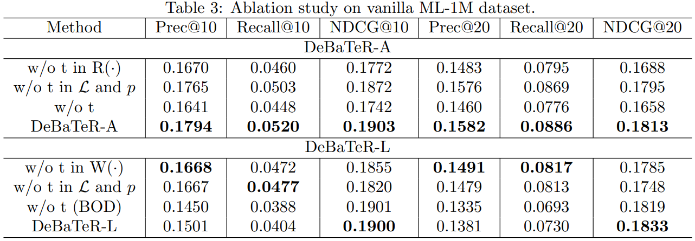
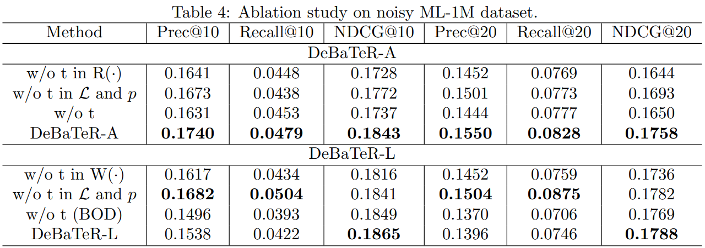
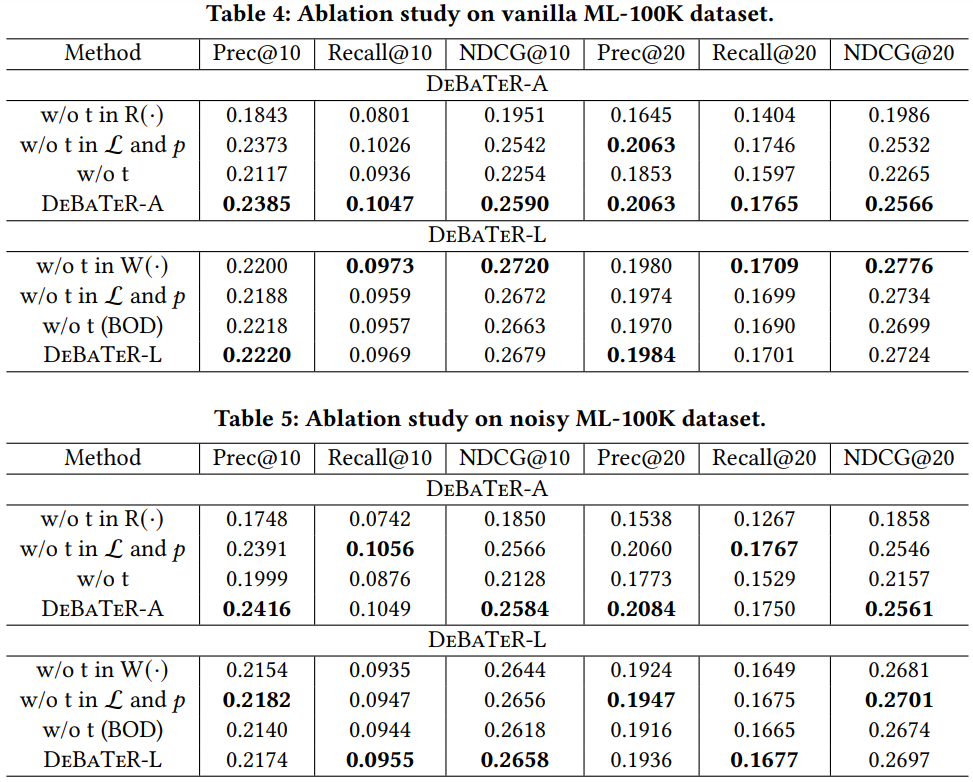

# DeBaTeR

## Updated experimental results

We add **three new baselines** to the tables: LightGCN (a model without CL), Bert4Rec (state-of-the-art sequential model for recommendation), and CL4SRec (a follow-up work of SaSRec). We also include **standard deviations** in the updated tables.

Although Bert4Rec outperforms our model on Amazon dataset, it performs much worse on others. The relative improvements in percentage against other 7 baselines per metric are:

- Vanilla dataset:
  - Prec, Recall, NDCG@10: 5.08%, 4.08%, 4.09%
  - Prec, Recall, NDCG@20: 4.02%, 3.21%, 3.49%
- Noisy dataset:
  - Prec, Recall, NDCG@10: 5.22%, 3.36%, 1.49%
  - Prec, Recall, NDCG@20: 4.31%, 1.95%, 1.43%

## Additional Ablation Study on ML-1M

The pattern generally aligns with the ablation study on ML-100K. It can be seen that removing time information from $R(\cdot)$ or $W(\cdot)$ will lead to less robustness against noise, while removing time information from $\mathcal{L}, p$ lead to a more robust algorithm while slightly affecting model performance. However, a new observation on ML-1M shows that time information in $W(\cdot)$ and $\mathcal{L}, p​$ combined will tend to have higher NDCG but not precision and recall, which aligns with the observation that DeBaTeR-L​ is more suitable for ranking tasks.